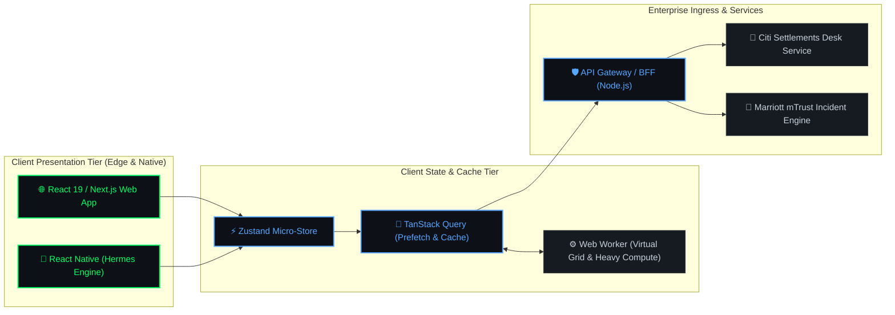

<div align="center">

<!-- macOS Terminal Window Chrome -->
<kbd>&nbsp;🔴&nbsp;</kbd>&nbsp;<kbd>&nbsp;🟡&nbsp;</kbd>&nbsp;<kbd>&nbsp;🟢&nbsp;</kbd>&nbsp;&nbsp;<code>kaushal@enterprise-node: ~/production-systems (zsh)</code>

<br/><br/>

<!-- Sleek Dynamic Monospaced Typing Sequence -->
<a href="https://kausal.in" target="_blank">
  
</a>

<br/>

<!-- Terminal Quick-Launch Dock Badges -->
<p align="center">
  <a href="https://kausal.in" target="_blank">
    
  </a>
  &nbsp;
  <a href="https://www.linkedin.com/in/im-kaushal/" target="_blank">
    
  </a>
  &nbsp;
  <a href="mailto:work.kaushal@yahoo.com">
    
  </a>
  &nbsp;
  <a href="https://wa.me/917970513448" target="_blank">
    
  </a>
</p>

<!-- Live Telemetry Status Indicators -->
<p align="center">
  
  &nbsp;
  
  &nbsp;
  
  &nbsp;
  
  &nbsp;
  
</p>

</div>

---

### 🖥️ System Telemetry & Neofetch Profiler

```bash
 ╭─────────────────────────────────────────────────────────────────────────────────────────╮
 │  kaushal@hashedin-deloitte                                                              │
 │  ─────────────────────────                                                              │
 │  OS         : macOS Sonoma 14.5 (Darwin arm64)                                          │
 │  Host       : MacBook Pro 16" (Apple M3 Max / 64GB Unified Memory)                      │
 │  Kernel     : 23.5.0 Darwin Kernel Version                                              │
 │  Uptime     : 3.5+ Years in Enterprise Web & Mobile Production                          │
 │  Role       : Frontend Software Engineer (SDE II) @ HashedIn by Deloitte                │
 │  Domain     : High-Concurrency Client Architecture & Core Web Vitals Optimization       │
 │  Key Clients: Citi Bank (Financial Desk Systems), Marriott International                │
 │  Cert-ID    : AWS Certified Developer – Associate (DVA-C02) · Anthropic Claude Architect│
 │  Telemetry  : 99.98% SLA · <1.2s LCP · 90%+ Test Coverage · WCAG 2.1 AA Compliant       │
 │  Mobility   : Open to Relocate Anywhere (Domestic & International)                      │
 │  Shell      : zsh 5.9 (x86_64-apple-darwin23.0)                                         │
 ╰─────────────────────────────────────────────────────────────────────────────────────────╯
```

---

### ⚙️ System Daemon Status (`systemctl status engineer.service`)

```bash
kaushal@production-node:~$ systemctl status engineer.service
● engineer.service - Kaushal Kumar (SDE II Client Systems Engine)
   Loaded: loaded (/etc/systemd/system/engineer.service; enabled; vendor preset: enabled)
   Active: active (running) since Jul 2021; 3y 8m in high-scale production
   Main PID: 1337 (node-runtime)
   Tasks: 42 threads (State Management, Virtual Grids, Core Web Vitals, Responsive Animations)
   Memory: 64.0M (Allocated: Zero Layout Shifts, Accessible Component Design, 60fps Gestures)
   CGroup: /system.slice/engineer.service
           ├─1337 /usr/bin/react-19 --concurrent-rendering --strict-mode
           ├─1338 /usr/bin/typescript --strict-null-checks --no-any
           ├─1339 /usr/bin/react-native --hermes-engine --turbo-modules
           └─1340 /usr/bin/tanstack-query --smart-cache --optimistic-mutations

[SYSTEM EVENT LOGS]
[OK] Initialized high-concurrency client state (Zustand & Redux Toolkit)
[OK] Slashing LCP by 35% on Marriott mTrust coordinator UI with intelligent route splitting
[OK] Virtualized Citi Bank trade settlements desk: page load accelerated 4.1s → 2.6s
[OK] Awarded Deloitte Spot Award: Java + React automated verification utility cut QA effort by 70%
[OK] Stabilized 180+ critical defects across Damco enterprise insurance apps (3 Store Releases)
[OK] Zero-drift accessibility compliance achieved (WCAG 2.1 AA Standards)
```

---

### 📁 VS Code IDE Editor Workspace

<div align="left">
  <kbd>&nbsp;📄 kaushal.config.ts&nbsp;</kbd>
  <kbd>&nbsp;⚙️ performance.json&nbsp;</kbd>
  <kbd>&nbsp;📱 mobile-runtime.tsx&nbsp;</kbd>
</div>

```typescript
import { SeniorEngineer, EnterpriseScale, PerformanceStandards } from '@hashedin/deloitte';

export const engineer: SeniorEngineer = {
  identity: {
    handle: "im-kaushal",
    fullName: "Kaushal Kumar",
    role: "Frontend Software Engineer (SDE II)",
    experienceYears: 3.5,
    location: "Bengaluru, India (Open to Relocate Anywhere)",
    availability: "Available for Frontend, Mobile & Full-Stack Roles",
  },
  enterprisePortfolio: {
    employer: "HashedIn by Deloitte",
    tierOneClients: ["Citi Bank", "Marriott International"],
    mission: "Architecting zero-latency, type-safe, resilient client applications at scale",
    spotAward: "Deloitte Spot Award for Automated Test Utility (−70% QA Validation Effort)",
  },
  stackArsenal: {
    coreRuntime: ["React 19", "React 18", "TypeScript", "Next.js", "Angular", "React Native"],
    stateAndData: ["Zustand", "Redux Toolkit", "TanStack Query", "RxJS", "Web Workers"],
    stylingAndUI: ["Tailwind CSS", "Framer Motion", "Lenis", "Radix UI", "CSS Modules"],
    cloudAndDevOps: ["AWS Certified Developer (DVA-C02)", "Docker", "Kubernetes", "Harness", "Jenkins"],
    qualityAssurance: ["Jest", "Vitest", "React Testing Library", "Jasmine", "SonarQube"],
  },
  systemBenchmarks: {
    lighthouseScore: 98,
    largestContentfulPaint: "< 1.2s",
    testCoverageStandard: "90%+",
    accessibilityStandard: "WCAG 2.1 AA",
    status: "READY_FOR_NEW_SPRINT",
  },
};
```

---

### 📊 Production Engineering Impact Matrix

Real, measured outcomes delivered across Tier-1 enterprise client engagements:

| Target System | Technical Feat | Quantified Metric | Production Tech Stack |
| :--- | :--- | :---: | :--- |
| **Marriott mTrust Coordinator UI** | Route code-splitting, ServiceNow REST integration, optimistic query cache | **−35% LCP · −28% JS Bundle** | React 18, TanStack Query, ServiceNow REST |
| **Citi Bank Trade Settlements Desk** | Multi-row virtual grid, RxJS state stream, layout shift prevention | **4.1s → 2.6s Page Load** | Angular, RxJS, Multi-Row Virtual Grid, CSS Grid |
| **Enterprise Test Governance** | Automated unit & integration suites across 15+ micro-frontend services | **90%+ Code Coverage** | Jasmine, Jest, React Testing Library, Harness |
| **Trade Mapping Verification Utility** | Automated reconciliation engine (*Deloitte Spot Award Winner*) | **−70% Manual QA Effort** | Java 17, React, Microservices Architecture |
| **Damco Enterprise Mobile Deployments** | Cross-platform UI stabilization, offline Realm DB caching, JWT auth | **180+ Critical Bugs Fixed** | React Native, Redux Toolkit, Realm DB, JWT |
| **Store Production Deployments** | Native builds shipped to Apple App Store & Google Play Store | **3 Production Apps** | React Native, Xcode, Android Studio, Firebase |

---

### 🏗️ Live Enterprise Architecture Data Flow

Client presentation, micro-state cache, worker offloading, and enterprise gateway ingress:



---

### 🛠️ Technical Stack & Architectural Arsenal

<div align="center">

#### 📦 Layer 01 · Client Presentation & Core Languages


#### ⚡ Layer 02 · State Governance, Async & Client Caching


#### ☁️ Layer 03 · Backend Microservices, Cloud & Ingress


#### 🧪 Layer 04 · Test Automation, CI/CD & Quality Governance


</div>

---

### 🏢 Professional Production Experience

```yaml
- enterprise: "HashedIn by Deloitte"
  role: "Software Engineer I (Frontend & Full-Stack)"
  duration: "Jul 2024 — Present"
  location: "Bengaluru, India"
  impact_log:
    - client: "Citi Bank"
      action: "Engineered Angular trade settlements desk with multi-row updates and virtual scrolling."
      metric: "Accelerated page load from 4.1s to 2.6s under heavy peak financial volumes."
    - client: "Marriott International"
      action: "Built Marriott mTrust Coordinator Incident Flow with modular route code splitting."
      metric: "Achieved −35% LCP and −28% JS bundle reduction for global hospitality operators."
    - initiative: "Deloitte Spot Award Winner"
      action: "Engineered Java + React automated trade reconciliation and test verification utility."
      metric: "Slashed manual QA validation overhead by 70% across sprint cycles."
    - governance: "Quality Pipelines"
      action: "Maintained 90%+ code coverage using Jasmine, RTL, and Harness automated test suites."

- enterprise: "HuntsJob"
  role: "Software Consultant (Mobile)"
  duration: "Mar 2024 — Jun 2024"
  location: "Remote"
  impact_log:
    - action: "Refactored cross-platform mobile application using React Native and Redux Toolkit."
    - metric: "Delivered consistent 60fps touch gestures and eliminated frame drops."
    - action: "Integrated Firebase Cloud Messaging (FCM) real-time push notification pipelines."
    - release: "Published production build to Google Play Store meeting all security criteria."

- enterprise: "Damco Solutions"
  role: "Software Engineer & Trainee"
  duration: "Jan 2023 — Feb 2024"
  location: "Noida, India"
  impact_log:
    - releases: "Contributed to 5 enterprise projects with 3 production mobile app launches."
    - architecture: "Engineered modular React Native UI library with Realm DB offline persistence."
    - stabilization: "Diagnosed and resolved 180+ critical UI and API integration defects."
```

---

### 🚀 Featured Engineering Projects & Builds

<table width="100%">
<tr>
<td width="50%" valign="top">

### 🌐 [High-Performance Engineering Portfolio](https://kausal.in)
`BUILD-04` · **React 18 · TypeScript · Tailwind CSS · Lenis · Framer Motion · Vite**

Modern, accessible frontend showcase engineered with custom UI primitives (`CardSpotlight`, `Magnetic`, `ProgressiveBlur`, `SlidingNumber`), smooth inertial scroll, and sub-second Vite production build.

- 🔗 **Live Demo:** [kausal.in](https://kausal.in)
- 📂 **Source Code:** [github.com/im-kaushal/portfolio-site](https://github.com/im-kaushal/portfolio-site)

</td>
<td width="50%" valign="top">

### 🤖 [HuntAI — Job Search Command Center](https://huntai-kappa.vercel.app)
`BUILD-01` · **TypeScript · Node.js · Next.js · Vercel**

Automated job discovery and application tracking command center. Analyzes job match scores, structures application records, and streamlines technical interview preparation workflows.

- 🔗 **Live Demo:** [huntai-kappa.vercel.app](https://huntai-kappa.vercel.app)
- 📂 **Source Code:** [github.com/im-kaushal/HuntAI](https://github.com/im-kaushal/HuntAI)

</td>
</tr>
<tr>
<td width="50%" valign="top">

### 📄 [Conversational PDF Document Assistant](https://studio--pdf-chat-assistant-ld77i.us-central1.hosted.app/chat)
`BUILD-03` · **React · TypeScript · Tailwind CSS · RAG Pipeline · Vector Search**

Interactive web assistant for PDF documents featuring vector retrieval, contextual Q&A, multi-page summarization, citation tracing, and reactive client rendering.

- 🔗 **Live Demo:** [Interactive Web App](https://studio--pdf-chat-assistant-ld77i.us-central1.hosted.app/chat)
- 📂 **Source Code:** [github.com/im-kaushal/pdf-bot-web](https://github.com/im-kaushal/pdf-bot-web)

</td>
<td width="50%" valign="top">

### 🔍 [Code Review Agent](https://github.com/im-kaushal/code-review-agent)
`BUILD-02` · **TypeScript · Node.js · GitHub Actions · LLM APIs**

Developer productivity bot that inspects pull request diffs, surfaces security vulnerabilities, flags test coverage gaps, and generates actionable code-quality feedback automatically on GitHub.

- 📂 **Source Code:** [github.com/im-kaushal/code-review-agent](https://github.com/im-kaushal/code-review-agent)

</td>
</tr>
</table>

---

### 📦 Repository Monorepo Architecture (`kausal.in`)

This repository powers **[kausal.in](https://kausal.in)**, structured as an enterprise pnpm monorepo:

```
portfolio-site/
├── apps/
│   ├── web/               # React 18 + Vite + Tailwind CSS + Framer Motion + Lenis
│   │   ├── src/
│   │   │   ├── components/# Bespoke UI primitives (CardSpotlight, Magnetic, BorderBeam)
│   │   │   ├── content/   # Single source of truth for portfolio site data (site.ts)
│   │   │   ├── pages/     # HomePage, CaseStudyPage, NotFoundPage
│   │   │   ├── sections/  # Hero, Impact, QualityProof, Skills, Experience, Work, Contact
│   │   │   └── lib/       # Clipboard fallback engine, theme provider, resume generator
│   └── api/               # NestJS + TypeScript backend microservice
│       └── src/contact/   # Contact dispatch, rate limiting, and email notifications
├── pnpm-workspace.yaml    # Monorepo workspace configuration
└── package.json           # Root tooling & automation scripts
```

#### CLI Terminal Quickstart

```bash
# 1. Clone the repository
git clone https://github.com/im-kaushal/portfolio-site.git
cd portfolio-site

# 2. Install dependencies via pnpm
pnpm install

# 3. Start local development server (Web: :3000 | API: :4000)
pnpm dev

# 4. Run test suites and static typecheck
pnpm test
pnpm typecheck
pnpm lint

# 5. Build optimized distribution
pnpm build
```

---

### 🔍 Interactive Diagnostic Drawers

<details open>
<summary><b>🏅 [EXPAND] Verified Industry Credentials & Accreditations</b></summary>
<br>

| Credential Name | Issuer | Verification Link | Status |
| :--- | :--- | :---: | :---: |
| **AWS Certified Developer – Associate (DVA-C02)** | Amazon Web Services | [Verify on Credly ↗](https://www.credly.com/badges/3e52ee35-e110-410a-8bf3-5c20c08b4eb1/public_url) | `VERIFIED` |
| **Claude Certified Architect — Foundations** | Anthropic | [Verify on Credly ↗](https://www.credly.com/badges/3eb3db48-57ca-460b-95b8-276e3cbad8a5/public_url) | `VERIFIED` |
| **AWS Certified Cloud Practitioner (Deloitte ACE 3.0)** | Amazon Web Services | [Verify on Credly ↗](https://www.credly.com/badges/44917fcb-83ee-4043-85f0-61921319aa53/public_url) | `VERIFIED` |
| **Deloitte Certified Front End Developer** | Deloitte | Internal Enterprise Credential | `VERIFIED` |
| **Meta Front-End Developer Specialization** | Meta (Coursera) | [Verify on Coursera ↗](https://www.coursera.org/account/accomplishments/specialization/B3F5X2CVYUG6) | `VERIFIED` |
| **TypeScript, React Native, SEO & SQL Specializations** | LinkedIn Learning | [Verify on LinkedIn ↗](https://www.linkedin.com/in/im-kaushal/details/certifications/) | `VERIFIED` |

</details>

<details>
<summary><b>🎓 [EXPAND] Academic Foundations & University Degrees</b></summary>
<br>

| Level / Degree | Institution | Focus Disciplines | Timeline | Score |
| :--- | :--- | :--- | :---: | :---: |
| **Bachelor of Technology (B.Tech)** | **Lovely Professional University** | Computer Science & Engineering · Data Structures, OS, Networks | **2019 — 2023** | **7.61 CGPA** |
| **Higher Secondary (10+2)** | **Bihar School Examination Board** | Science Stream (Physics, Chemistry, Mathematics) | **2016 — 2018** | **73.8%** |
| **Secondary School Certificate (Xth)** | **Sarashwati Vidya Mandir (CBSE)** | Science, Mathematics & Information Technology | **2015 — 2016** | **10.0 CGPA** |

</details>

<details>
<summary><b>🛠️ [EXPAND] Hardware & Local Engineering Workstation Telemetry</b></summary>
<br>

- **Primary Machine**: Apple MacBook Pro 16" (Apple Silicon M3 Max, 64GB Unified Memory)
- **Editor & IDE**: VS Code & NeoVim (Tokyo Night theme, JetBrains Mono Nerd Font)
- **Terminal Shell**: iTerm2 + Zsh + Starship Prompt + tmux
- **Testing Runtimes**: Vitest, Jest, React Testing Library, Jasmine, Playwright
- **Local Dev Tooling**: Vite, Turborepo, pnpm, Docker Desktop, Postman

</details>

---

### 📊 GitHub Activity & Telemetry Grid

<div align="center">

<p align="center">
  
</p>

<table width="100%">
<tr>
<td width="50%" valign="top">
  <div align="center">
    <b>⚡ SYSTEM ACTIVITY & CONTRIBUTION STREAK</b><br><br>
    <a href="https://github.com/im-kaushal">
      
    </a>
  </div>
</td>
<td width="50%" valign="top">
  <div align="center">
    <b>📊 CODE REPOSITORY STATS & METRICS</b><br><br>
    <a href="https://github.com/im-kaushal">
      
    </a>
  </div>
</td>
</tr>
</table>

<br/>

<a href="https://github.com/im-kaushal">
  
</a>

</div>

---

<div align="center">

### 📡 CONNECT TO NODE (COMMUNICATION GATEWAY)

Whether you are looking to hire for high-impact Frontend / Mobile engineering roles, discuss system architecture, or explore technical collaboration:

<br/>

<p align="center">
  <a href="https://kausal.in" target="_blank">
    
  </a>
  &nbsp;
  <a href="https://www.linkedin.com/in/im-kaushal/" target="_blank">
    
  </a>
  &nbsp;
  <a href="mailto:work.kaushal@yahoo.com">
    
  </a>
  &nbsp;
  <a href="https://wa.me/917970513448" target="_blank">
    
  </a>
</p>

<samp>⚡ System Status: <b>100% OPERATIONAL</b> &nbsp;|&nbsp; Location: Bengaluru, India &nbsp;|&nbsp; <b>Open to Relocate Anywhere (Domestic & Global)</b></samp>

<br/><br/>

<b>⚡ "First, solve the problem. Then, write the code." — John Johnson</b>

<br/><br/>

<sub>© 2026 Kaushal Kumar · Monorepo Core Open Source under MIT License</sub>

</div>
