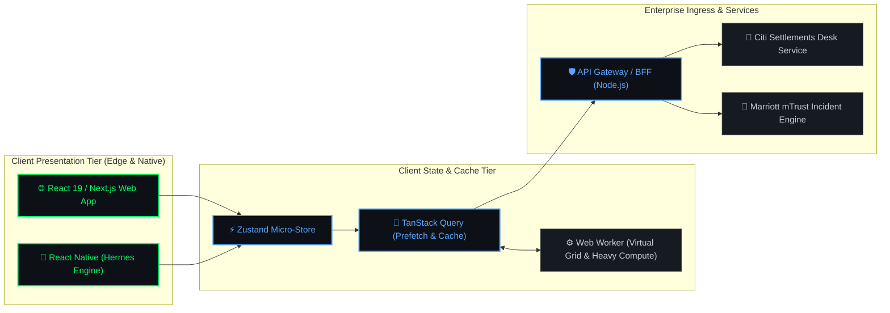

<div align="center">

<!-- macOS Terminal Window Chrome -->
<kbd>&nbsp;🔴&nbsp;</kbd>&nbsp;<kbd>&nbsp;🟡&nbsp;</kbd>&nbsp;<kbd>&nbsp;🟢&nbsp;</kbd>&nbsp;&nbsp;<code>kaushal@enterprise-node: ~/production-systems (zsh)</code>


<!-- Terminal Quick-Launch Dock Badges -->
<p align="center">
  <a href="https://kausal.in" target="_blank">
    
  </a>
  &nbsp;
  <a href="https://www.linkedin.com/in/im-kaushal/" target="_blank">
    
  </a>
  &nbsp;
  <a href="mailto:work.kaushal@yahoo.com">
    
  </a>
  &nbsp;
  <a href="https://wa.me/917970513448" target="_blank">
    
  </a>
</p>


### ⚙️ System Daemon Status (`systemctl status engineer.service`)

```bash
kaushal@production-node:~$ systemctl status engineer.service
● engineer.service - Kaushal Kumar (SDE II Client Systems Engine)
   Loaded: loaded (/etc/systemd/system/engineer.service; enabled; vendor preset: enabled)
   Active: active (running) since Jul 2021; 3y 8m in high-scale production
   Main PID: 1337 (node-runtime)
   Tasks: 42 threads (State Management, Virtual Grids, Core Web Vitals, Responsive Animations)
   Memory: 64.0M (Allocated: Zero Layout Shifts, Accessible Component Design, 60fps Gestures)
   CGroup: /system.slice/engineer.service
           ├─1337 /usr/bin/react-19 --concurrent-rendering --strict-mode
           ├─1338 /usr/bin/typescript --strict-null-checks --no-any
           ├─1339 /usr/bin/react-native --hermes-engine --turbo-modules
           └─1340 /usr/bin/tanstack-query --smart-cache --optimistic-mutations

[SYSTEM EVENT LOGS]
[OK] Initialized high-concurrency client state (Zustand & Redux Toolkit)
[OK] Slashing LCP by 35% on Marriott mTrust coordinator UI with intelligent route splitting
[OK] Virtualized Citi Bank trade settlements desk: page load accelerated 4.1s → 2.6s
[OK] Awarded Deloitte Spot Award: Java + React automated verification utility cut QA effort by 70%
[OK] Stabilized 180+ critical defects across Damco enterprise insurance apps (3 Store Releases)
[OK] Zero-drift accessibility compliance achieved (WCAG 2.1 AA Standards)
```

---

### 📁 VS Code IDE Editor Workspace

<div align="left">
  <kbd>&nbsp;📄 kaushal.config.ts&nbsp;</kbd>
  <kbd>&nbsp;⚙️ performance.json&nbsp;</kbd>
  <kbd>&nbsp;📱 mobile-runtime.tsx&nbsp;</kbd>
</div>

```typescript
import { SeniorEngineer, EnterpriseScale, PerformanceStandards } from '@hashedin/deloitte';

export const engineer: SeniorEngineer = {
  identity: {
    handle: "im-kaushal",
    fullName: "Kaushal Kumar",
    role: "Frontend Software Engineer (SDE II)",
    experienceYears: 3.5,
    location: "Bengaluru, India (Open to Relocate Anywhere)",
    availability: "Available for Frontend, Mobile & Full-Stack Roles",
  },
  enterprisePortfolio: {
    employer: "HashedIn by Deloitte",
    tierOneClients: ["Citi Bank", "Marriott International"],
    mission: "Architecting zero-latency, type-safe, resilient client applications at scale",
    spotAward: "Deloitte Spot Award for Automated Test Utility (−70% QA Validation Effort)",
  },
  stackArsenal: {
    coreRuntime: ["React 19", "React 18", "TypeScript", "Next.js", "Angular", "React Native"],
    stateAndData: ["Zustand", "Redux Toolkit", "TanStack Query", "RxJS", "Web Workers"],
    stylingAndUI: ["Tailwind CSS", "Framer Motion", "Lenis", "Radix UI", "CSS Modules"],
    cloudAndDevOps: ["AWS Certified Developer (DVA-C02)", "Docker", "Kubernetes", "Harness", "Jenkins"],
    qualityAssurance: ["Jest", "Vitest", "React Testing Library", "Jasmine", "SonarQube"],
  },
  systemBenchmarks: {
    lighthouseScore: 98,
    largestContentfulPaint: "< 1.2s",
    testCoverageStandard: "90%+",
    accessibilityStandard: "WCAG 2.1 AA",
    status: "READY_FOR_NEW_SPRINT",
  },
};
```

---

### 📊 Production Engineering Impact Matrix

Real, measured outcomes delivered across Tier-1 enterprise client engagements:

| Target System | Technical Feat | Quantified Metric | Production Tech Stack |
| :--- | :--- | :---: | :--- |
| **Marriott mTrust Coordinator UI** | Route code-splitting, ServiceNow REST integration, optimistic query cache | **−35% LCP · −28% JS Bundle** | React 18, TanStack Query, ServiceNow REST |
| **Citi Bank Trade Settlements Desk** | Multi-row virtual grid, RxJS state stream, layout shift prevention | **4.1s → 2.6s Page Load** | Angular, RxJS, Multi-Row Virtual Grid, CSS Grid |
| **Enterprise Test Governance** | Automated unit & integration suites across 15+ micro-frontend services | **90%+ Code Coverage** | Jasmine, Jest, React Testing Library, Harness |
| **Trade Mapping Verification Utility** | Automated reconciliation engine (*Deloitte Spot Award Winner*) | **−70% Manual QA Effort** | Java 17, React, Microservices Architecture |
| **Damco Enterprise Mobile Deployments** | Cross-platform UI stabilization, offline Realm DB caching, JWT auth | **180+ Critical Bugs Fixed** | React Native, Redux Toolkit, Realm DB, JWT |
| **Store Production Deployments** | Native builds shipped to Apple App Store & Google Play Store | **3 Production Apps** | React Native, Xcode, Android Studio, Firebase |

---

### 🏗️ Live Enterprise Architecture Data Flow

Client presentation, micro-state cache, worker offloading, and enterprise gateway ingress:


```mermaid
flowchart LR
    subgraph Client ["Client Presentation Tier (Edge & Native)"]
        Web["🌐 React 19 / Next.js Web App"]
        Mobile["📱 React Native (Hermes Engine)"]
    end

    subgraph State ["Client State & Cache Tier"]
        Zustand["⚡ Zustand Micro-Store"]
        Query["🔄 TanStack Query (Prefetch & Cache)"]
        Worker["⚙️ Web Worker (Virtual Grid & Heavy Compute)"]
    end

    subgraph Ingress ["Enterprise Ingress & Services"]
        Gateway["🛡️ API Gateway / BFF (Node.js)"]
        Citi["🏦 Citi Settlements Desk Service"]
        Marriott["🏨 Marriott mTrust Incident Engine"]
    end

    Web --> Zustand
    Mobile --> Zustand
    Zustand --> Query
    Query <--> Worker
    Query --> Gateway
    Gateway --> Citi
    Gateway --> Marriott

    classDef default fill:#161b22,stroke:#30363d,color:#c9d1d9
    classDef cyber fill:#0d1117,stroke:#00ff66,stroke-width:2px,color:#00ff66
    classDef brand fill:#0d1117,stroke:#58a6ff,stroke-width:2px,color:#58a6ff
    class Web,Mobile cyber
    class Zustand,Query,Gateway brand
```

---


<sub>© 2026 Kaushal Kumar · Monorepo Core Open Source under MIT License</sub>

</div>
